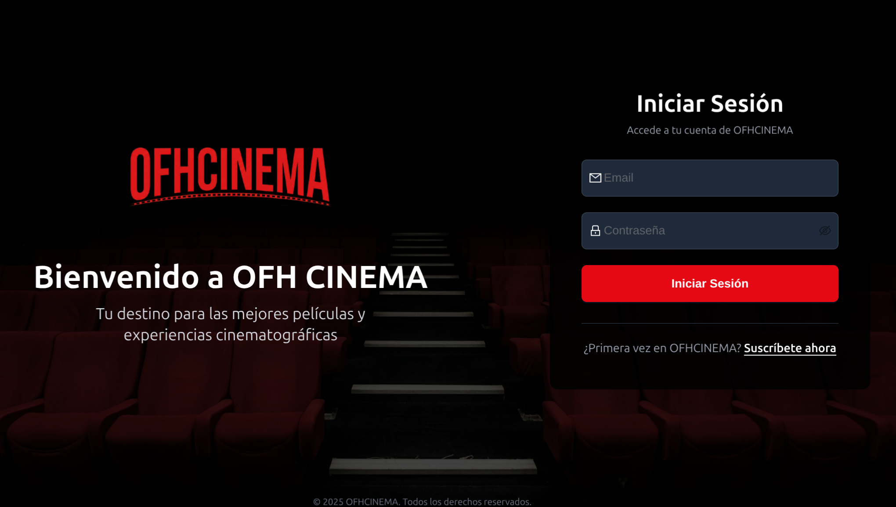
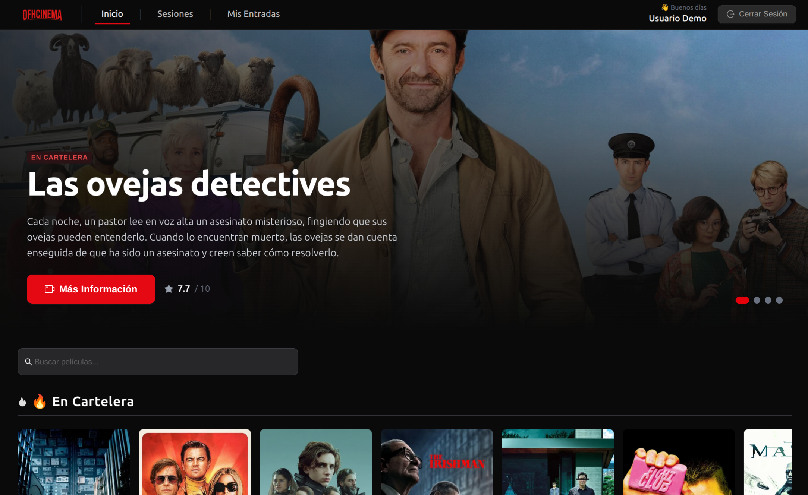
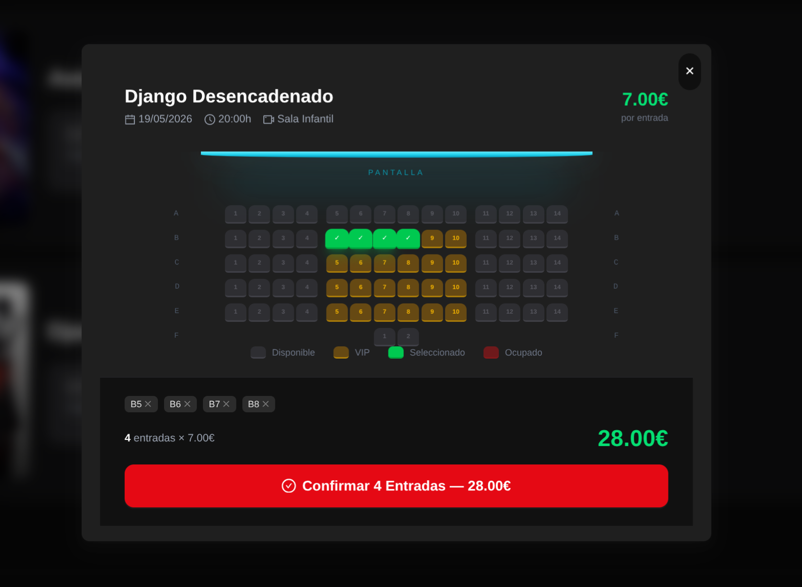
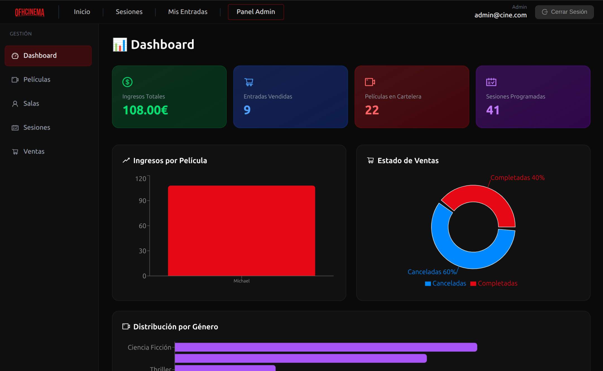

# 🎬 OFH CINEMA - Tu cine en casa

<div align="center">
  <h3>Sistema Completo de Gestión de Cines (Full-Stack)</h3>
  <p>Una aplicación moderna y dinámica para la gestión de cines, reserva de butacas y visualización de cartelera, construida con Spring Boot y React.</p>
</div>

---

## 📖 Acerca del Proyecto

**OFH CINEMA** es una solución integral (Full-Stack) desarrollada como proyecto final para gestionar todos los aspectos de un cine moderno. Inspirado en el diseño y la experiencia de usuario de plataformas como Netflix, este sistema permite a los usuarios explorar la cartelera, ver detalles de las películas, seleccionar sus butacas en diferentes tipos de salas (IMAX, VIP, 4DX) y gestionar sus entradas, todo bajo un robusto sistema de seguridad basado en roles.

## 📸 Galería del Proyecto (Screenshots)

> 💡 **Nota:** Las imágenes se encuentran en la carpeta `/screenshots/`. Añade aquí tus capturas para lucir el proyecto.

<div align="center">
  
  
</div>
<div align="center">
  
  
</div>

---

## ✨ Características y Tareas Implementadas

### 🛡️ Backend & Seguridad (JWT, RBAC y Auditoría)
*   **Autenticación JWT Stateless:** CSRF deshabilitado y sesión configurada como `STATELESS`. Devolución automática de Token en el registro. Las URL públicas se limitan a `/api/test/**`, `/api/v1/auth/**` y `/error/`.
*   **Gestión de Roles y Permisos (RBAC):** Uso de `SecurityConfig` y `@PreAuthorize` para segmentar el acceso:
    *   **Público:** Consulta de cartelera (Películas) y horarios (Sesiones).
    *   **Usuario (`ROLE_USER`):** Registro, compra de entradas y gestión (ver/cancelar) únicamente de sus propias ventas y datos de perfil.
    *   **Administrador (`ROLE_ADMIN`):** Gestión total (CRUD) de salas, películas, sesiones, además de la consulta y supervisión de todas las ventas de la plataforma.
*   **Sistema de TokenRefresh:** Doble token implementado (Access Token de corta duración y Refresh Token de larga duración persistido en base de datos vinculada al usuario) con endpoint de renovación para mantener la sesión activa sin reintroducir credenciales.
*   **Manejo de Errores Profesional:** Configuración del proyecto para devolver páginas de error de Spring y respuestas estructuradas en formato JSON (401/403) ante fallos de seguridad o validación.
*   **Auditoría de Datos (Trazabilidad):** Integración de **Spring Data JPA Auditing** (`@CreatedBy` y `@CreatedDate`) para registrar automáticamente qué usuario creó cada Venta o Entrada y en qué momento, sin código manual.
*   **Integración con Postman:** Colección organizada por Entidades (Endpoints) y URLs públicas, con un script pre-request que captura y aplica automáticamente el token de sesión en cada petición.

### 💻 Frontend Avanzado (React SPA)
*   **Experiencia de Usuario (UX) Premium:** Interfaz fluida, temática cinematográfica atractiva, animaciones y diseño completamente responsive. Catálogo dinámico de películas con filtros/búsqueda y un flujo de selección de butacas altamente intuitivo y visual.
*   **Interfaz Dinámica por Roles:** La aplicación transforma sus menús y opciones según el rol del usuario (ej. el ADMIN visualiza gráficas o botones de edición; el USUARIO visualiza sus propias compras y carrito).
*   **Arquitectura de Seguridad Frontend:** Rutas protegidas (Protected Routes). Implementación estricta de **Axios Interceptors** para adjuntar el JWT automáticamente en las cabeceras y manejar la lógica de refresco de token o redirección al Login si expira (Error 401).
*   **Gestión Global de Estado:** Uso avanzado de **Context API** para mantener de forma global y reactiva la sesión del usuario, la validación del ciclo de vida del JWT y el estado del carrito de compras.
*   **Flujo Completo de Autenticación:** Formulario de login que envía credenciales y persiste el token (Storage), consumo protegido mediante peticiones GET autorizadas, y funcionalidad robusta de "Cerrar Sesión" que limpia el estado.

---

## 🛠️ Tecnologías Utilizadas

### 💻 Frontend (React SPA)
*   **React 19** + **Vite**
*   **Tailwind CSS v4** (Estilos modernos y creativos)
*   **Ant Design (antd)** (Componentes de UI)
*   **React Router v7** (Enrutamiento dinámico y protección)
*   **Axios** (Peticiones HTTP e Interceptors)
*   **Context API / LocalStorage** (Manejo de Estado y Persistencia)

### ⚙️ Backend (Spring Boot)
*   **Java 21** + **Spring Boot 3.4.4**
*   **Spring Security & JWT** (Filtros, Autenticación de doble Token)
*   **Spring Data JPA & Auditing** (Persistencia y Trazabilidad)
*   **PostgreSQL** (BBDD Relacional)
*   **MapStruct & Lombok** (Mapeo DTO y simplificación)

---

## 🚀 Guía de Inicio Rápidos

### Prerrequisitos
*   **Node.js** (v18 o superior) y **npm**
*   **Java 21** (JDK)
*   **Maven**
*   **PostgreSQL** (o base de datos configurada en el `application.properties` / `.env`)
*   Clave API de **TMDB**

### Instalación y Ejecución

#### 1. Configurar y lanzar el Backend
```bash
cd backend
# Configura las variables de entorno o application.properties
./mvnw spring-boot:run
```

#### 2. Configurar y lanzar el Frontend
```bash
cd frontend
npm install
# Configura tu archivo .env.local si es necesario
npm run dev
```

El frontend estará disponible en `http://localhost:5173` y la API backend en `http://localhost:8080`.

---

## 📬 Contacto y Autores

Desarrollado como Proyecto Final (Subida de Nota).
* **Autor:** Óscar
